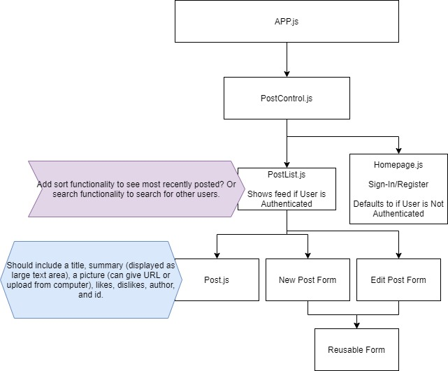

# Pictaverse

#### A social media site created with React. Users are able to create picture-based mini blog-posts that serve as a travel guide for other users. Created on 12/11/2020, Updated on 12/18/2020.

#### By: Janet Karpenske

##### This is a React social media website that allows the user full CRUD functionality to create picture-based blog posts about their travels.

### Link to Site on Github Pages
#### This site is currently not hosted.

### Link to Previous Repository
#### https://github.com/janetkarpenske/react-pictaverse

## Setup/Installation Requirements

1. Download/Clone The Project from the Github Repo by using link from Github, or open terminal and run command: "git clone https://github.com/janetkarpenske/react-pictaverse"
2. Navigate into main directory called 'pictaverse' and run command "npm install" in terminal.
3. To view on server run command "npm run start".

## React Component Diagram

## Known Bugs
No Known Bugs

## Support & Contact Details
For additional information or to contact Janet Karpenske:
cell: (971) 241-1160
email: janetkarpenske@gmail.com
LinkedIn: Janet Karpenske

## Technologies Used
React, JavaScript, HTML, CSS, Bootstrap, JSX

## Licensing
Copyright (c) 2020 **_{Janet Karpenske}_**

This software is licensed under MIT license.